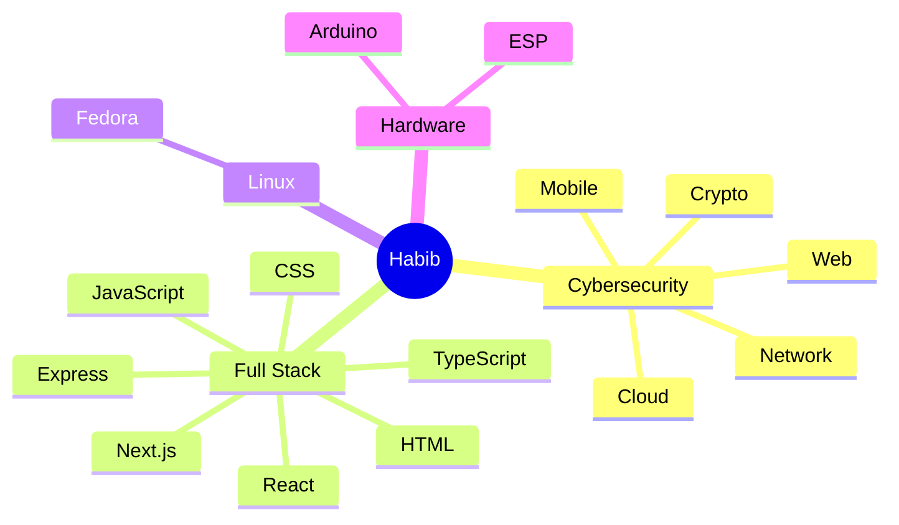

<div align="center">


<br>


<a href="https://github.com/youse7abib">

</a>

<a href="https://github.com/youse7abib?tab=repositories">

</a>

</div>

---

# 👋 About Me

```ts
const Habib = {

    pronouns: "He/Him",

    education: "STEM High School for Boys - 6th of October",

    roles: [
        "Penetration Tester",
        "CTF Setter",
        "Full Stack Developer (Learning)"
    ],

    operatingSystem: "Fedora Linux",

    cybersecurity: [
        "Web Exploitation",
        "Mobile Exploitation",
        "Cloud Attacking",
        "Network Security",
        "Cryptography",
        "Social Engineering"
    ],

    hardware: [
        "Arduino",
        "ESP",
        "Sensors",
        "Electronics"
    ],

    currentlyLearning: [
        "Next.js",
        "Express.js",
        "TypeScript",
        "Advanced Cloud Attacking"
    ],

    motto: "One vulnerability is all I need."
}
```

---

# 🌐 Connect With Me

<p align="center">

<a href="https://github.com/youse7abib">

</a>

<a href="https://linkedin.com">

</a>

<a href="mailto:YOUR_EMAIL">

</a>

<a href="https://discord.com">

</a>

</p>

---

# 💻 Tech Stack

<div align="center">

## Languages

<a href="https://developer.mozilla.org/en-US/docs/Web/HTML">

</a>

<a href="https://developer.mozilla.org/en-US/docs/Web/CSS">

</a>

<a href="https://developer.mozilla.org/en-US/docs/Web/JavaScript">

</a>

<a href="https://www.typescriptlang.org/">

</a>

<a href="https://www.python.org/">

</a>

<a href="https://www.php.net/">

</a>

<a href="https://www.gnu.org/software/bash/">

</a>

---

## Frontend

<a href="https://react.dev/">

</a>

<a href="https://nextjs.org/">

</a>

<a href="https://tailwindcss.com/">

</a>

<a href="https://getbootstrap.com/">

</a>

---

## Backend

<a href="https://nodejs.org/">

</a>

<a href="https://expressjs.com/">

</a>

<a href="https://firebase.google.com/">

</a>

<a href="https://www.mongodb.com/">

</a>

<a href="https://www.mysql.com/">

</a>

---

## Tools

<a href="https://git-scm.com/">

</a>

<a href="https://github.com/">

</a>

<a href="https://code.visualstudio.com/">

</a>

<a href="https://www.figma.com/">

</a>

<a href="https://fedoraproject.org/">

</a>

<a href="https://kernel.org/">

</a>

<a href="https://www.arduino.cc/">

</a>

</div>

---

# ⚡ Current Focus

```text
████████████████████░░░░  Full Stack Development

██████████████████░░░░░░  Advanced Cloud Attacking

██████████████████████░░  Penetration Testing

███████████████████████░  Building CTF Challenges
```

---

# 🔐 Cybersecurity

<div align="center">

| 🌐 Web Security | 📱 Mobile Security | ☁️ Cloud Security |
|:---------------:|:------------------:|:-----------------:|
| ✅ Web Exploitation | ✅ Mobile Exploitation | ✅ Cloud Attacking |

| 🌍 Network | 🔒 Cryptography | 🎭 Social Engineering |
|:----------:|:---------------:|:---------------------:|
| ✅ Network Security | ✅ Crypto | ✅ Human Hacking |

</div>

---

# 🤖 Hardware & Robotics

```text
Arduino IDE
├── Arduino Boards
├── ESP8266 / ESP32
├── Sensors
├── Relays
├── Motors
└── Electronics
```

---

# 🧠 Learning Roadmap



---

# 📊 GitHub Analytics

<div align="center">


</div>

---

<div align="center">


</div>

---

# 📈 Contribution Graph

<div align="center">


</div>

---

# 🏆 GitHub Trophies

<div align="center">


</div>

---

# 📑 Profile Summary

<div align="center">


</div>

<br>

<div align="center">


</div>

---

# ⚙️ Development Workflow

```text
        ☕ Coffee
            │
            ▼
      💡 New Idea
            │
            ▼
      💻 Write Code
            │
            ▼
       🐛 Bugs Found
            │
            ▼
     🔥 Debug Everything
            │
            ▼
      😌 It Finally Works
            │
            ▼
      🚀 Push to GitHub
            │
            └──────────────┐
                           ▼
                   💥 New Bug Appears
```

---

# 💻 Favorite Environment

```yaml
Operating System:
  - Fedora Linux

Editor:
  - VS Code

Version Control:
  - Git
  - GitHub

Favorite Theme:
  - Tokyo Night 🌌

Terminal:
  - Bash
```

---

# ⏱️ Weekly Development Breakdown

<!--START_SECTION:waka-->

```text
No activity tracked yet.
Connect WakaTime to automatically update this section.
```

<!--END_SECTION:waka-->

---

# 🐍 Contribution Snake

<div align="center">

<picture>
  <source media="(prefers-color-scheme: dark)" srcset="https://raw.githubusercontent.com/youse7abib/youse7abib/output/github-contribution-grid-snake-dark.svg" />
  <source media="(prefers-color-scheme: light)" srcset="https://raw.githubusercontent.com/youse7abib/youse7abib/output/github-contribution-grid-snake.svg" />
  
</picture>

</div>

---

# 🚀 Featured Projects

<div align="center">

<a href="https://github.com/youse7abib/STEM-Mentorship">

</a>

<a href="https://github.com/youse7abib/YOUR_SECOND_REPOSITORY">

</a>

<br><br>

<a href="https://github.com/youse7abib/YOUR_THIRD_REPOSITORY">

</a>

<a href="https://github.com/youse7abib/YOUR_FOURTH_REPOSITORY">

</a>

</div>

---

# 📈 Coding Activity

<div align="center">


</div>

---

# 💬 Random Dev Quote

<div align="center">


</div>

---

# 🌍 Connect With Me

<div align="center">

<a href="https://github.com/youse7abib">

</a>

<a href="https://linkedin.com/in/YOUR_LINKEDIN">

</a>

<a href="mailto:YOUR_EMAIL">

</a>

<a href="https://discord.com/users/YOUR_ID">

</a>

<a href="https://YOUR_WEBSITE">

</a>

</div>

---

# ☕ Support

<div align="center">

If you enjoy my projects, consider giving them a ⭐

Building secure applications • Solving CTFs • Learning every day 🚀

</div>

---

<div align="center">


</div>
